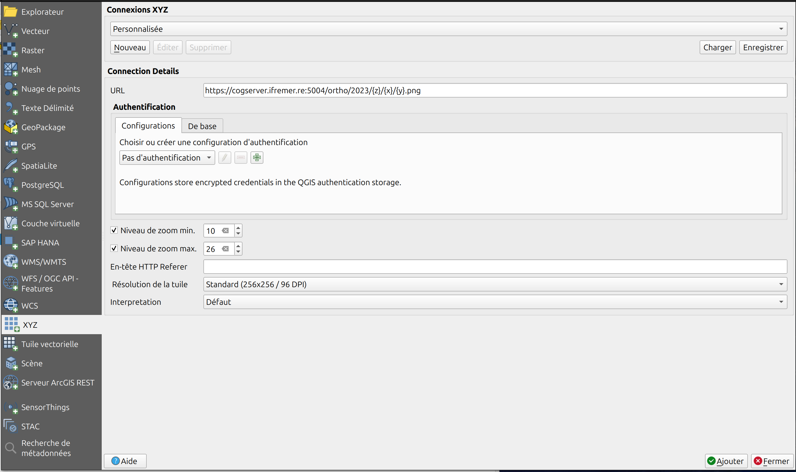

<p align="center">
  <a href="https://github.com/SeatizenDOI/cog-server/graphs/contributors"></a>
  <a href="https://github.com/SeatizenDOI/cog-server/network/members"></a>
  <a href="https://github.com/SeatizenDOI/cog-server/issues"></a>
  <a href="https://github.com/SeatizenDOI/cog-server/blob/master/LICENSE"></a>
  <a href="https://github.com/SeatizenDOI/cog-server/pulls"></a>
  <a href="https://github.com/SeatizenDOI/cog-server/stargazers"></a>
  <a href="https://github.com/SeatizenDOI/cog-server/watchers"></a>
</p>

<div align="center">

# COG Server

</div>

## Summary

* [Docker](#docker)
* [Installation](#installation)
* [Configure access with QGIS](#configure-access-with-qgis)
* [Seatizen Monitoring](#seatizenmonitoring)
* [Create your dataset](#create-your-dataset)
* [Contributing](#contributing)
* [License](#license)

## Docker

Image are automatically built with a CI pipeline on github. They are available under the name :
* seatizendoi/cog-server:latest

If you want to run docker image from dockerhub add seatizendoi/ to the beginning of image name.

This image docker is a fastapi server.

Build command :
```bash
docker build -f Dockerfile -t seatizendoi/cog-server:latest .
```

Run command
```bash
docker run --rm -v /home/bioeos/Documents/project_hub/cog-server/data/:/app/data --name cog-server -p 5004:5004 seatizendoi/cog-server:latest
docker run --rm -v -d /home/debian/villien/data/:/app/data --name cog-server -p 5004:5004 seatizendoi/cog-server:latest

```

## Installation

To ensure a consistent environment for all users, this project uses a Conda environment defined in a `cog_server_env.yml` file. Follow these steps to set up your environment:

1. **Install Conda:** If you do not have Conda installed, download and install [Miniconda](https://docs.conda.io/en/latest/miniconda.html) or [Anaconda](https://www.anaconda.com/products/distribution).

2. **Create the Conda Environment:** Navigate to the root of the project directory and run the following command to create a new environment from the `cog_server_env.yml` file:
   ```bash
   conda env create -f cog_server_env.yml
   ```

3. **Activate the Environment:** Once the environment is created, activate it using:
   ```bash
   conda activate cog_server_env
   ```

## Configure access with QGIS

1. **Load a base map:** Load a base map like Google Satellite available in QuickMapServices in contributors ressources.

2. **Use XYZ Data Connexion:** Open XYZ data connexion and click on new connexion. Filled the popup like this :

* Name: Ortho Ifremer DOI
* URL: https://cogserver.ifremer.re/ortho/2023/{z}/{x}/{y}.png?asv=true

* Min Zoom level: 10
* Max Zoom level: 26
* Tile resolution: 256*256

* Name: Bathy Ifremer DOI
* URL: https://cogserver.ifremer.re/bathy/2023/{z}/{x}/{y}.png
* Min Zoom level: 14
* Max Zoom level: 22
* Tile resolution: 256*256

<div align="center">
  
</div>

Finally click on `OK`.

You will see the orthophoto tiles on reunion island in the west coast.

## Seatizen Monitoring

You can also visualize the tiles on the map of [seatizenmonitoring](https://seatizenmonitoring.ifremer.re)


## Contributing

Contributions are welcome! To contribute, please follow these steps:

1. Fork the repository.
2. Create a new branch for your feature or fix.
3. Commit your changes with clear, descriptive messages.
4. Push your branch and submit a pull request.

## License

This framework is distributed under the CC0-1.0 license. See `LICENSE` for more information.
